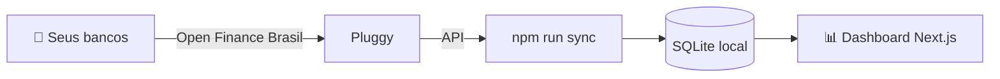

# 💰 OpenControllerFinance

> **Seu Open Finance pessoal, gratuito e self-hosted.**

Sincronize automaticamente seus gastos e ganhos de **Mercado Pago, Nubank, Inter, Banco do Brasil e Itaú** via [Open Finance Brasil](https://openfinancebrasil.org.br/), usando a [Pluggy](https://pluggy.ai) — gratuito para extração dos seus próprios dados via [MeuPluggy](https://meu.pluggy.ai). Todos os dados ficam **na sua máquina**, em um banco SQLite local.


<!-- 📸 Screenshot do dashboard -->


---

## ✨ Funcionalidades

- 🔄 **Sincronização automática** de contas, transações e faturas de cartão de crédito (`npm run sync`)
- 🧠 **Categorização inteligente em 4 camadas**: suas regras > dicionário built-in de comércios brasileiros (iFood, Amazon, AliExpress, Mercado Livre…) > categoria da Pluggy > Outros
- ✏️ **Edição manual de categoria** que pode virar regra automática para as próximas transações
- 🎯 **Orçamento mensal com 3 modos**: meta fixa, média dos ganhos dos últimos 3 meses ou renda informada — com percentual de poupança
- 🔔 **Alertas** quando você se aproxima do limite do mês (no app + Telegram opcional) e quando a fatura está perto do vencimento
- 💳 **Página de faturas por cartão**, com uso do limite
- 📊 **Aba Análise**: top gastos por categoria e por estabelecimento
- 🔁 **Gastos recorrentes manuais** que reservam parte do orçamento (aluguel, assinaturas…)
- ⚙️ **Página de configurações**
- 🔒 **100% local**: SQLite na sua máquina, nada de nuvem de terceiros

## 🧩 Como funciona



1. Você conecta seus bancos uma única vez via Open Finance (consentimento aprovado no app do próprio banco).
2. A Pluggy agrega os dados das instituições e os disponibiliza via API.
3. O script `npm run sync` busca contas, transações e faturas e grava tudo no SQLite local.
4. O dashboard Next.js lê o banco local e exibe tudo: orçamento, faturas, análises e alertas.

## 📋 Pré-requisitos

- **Node.js 20+**
- Contas nos bancos que deseja conectar (Mercado Pago, Nubank, Inter, Banco do Brasil e/ou Itaú — todos com cobertura confirmada no Open Finance da Pluggy)
- Conta gratuita na **Pluggy** (via [meu.pluggy.ai](https://meu.pluggy.ai) + [dashboard.pluggy.ai](https://dashboard.pluggy.ai))

## 🚀 Setup passo a passo

1. **Clone o repositório e instale as dependências**

   ```bash
   git clone https://github.com/Andrewtk9/OpenControllerFinance.git
   cd OpenControllerFinance
   npm install
   ```

2. **Crie o arquivo de ambiente**

   ```bash
   cp .env.example .env
   ```

3. **Conecte seus bancos no MeuPluggy**

   - Acesse [meu.pluggy.ai](https://meu.pluggy.ai) e crie sua conta.
   - Clique em conectar, escolha sua instituição (Nubank, Inter, BB, Itaú, Mercado Pago…) e siga o fluxo.
   - O **consentimento do Open Finance é aprovado dentro do app do próprio banco** — suas credenciais bancárias nunca passam pelo MeuPluggy nem por este app.
   - Repita para cada banco que quiser sincronizar.

4. **Crie sua aplicação de desenvolvedor na Pluggy**

   - Registre-se em [dashboard.pluggy.ai](https://dashboard.pluggy.ai) (vem com trial de 15 dias da plataforma completa).
   - Crie uma aplicação de desenvolvimento — ela fornece o `client_id` e o `client_secret`.
   - Copie ambos para `PLUGGY_CLIENT_ID` e `PLUGGY_CLIENT_SECRET` no seu `.env`.

5. **Obtenha os ITEM_IDS (vinculando o MeuPluggy à sua aplicação)**

   - No Dashboard da Pluggy, abra a aplicação **Demo** e use a opção **"MeuPluggy OAuth Authorization"** para autorizar sua conta do MeuPluggy na sua aplicação de desenvolvedor.
   - **Repita a autorização para cada banco** conectado no MeuPluggy — cada instituição vira um *item* (uma conexão), que funciona como proxy da conexão original e é atualizado diariamente pela Pluggy.
   - Copie o **ID de cada item** criado e cole em `PLUGGY_ITEM_IDS`, separados por vírgula:

     ```env
     PLUGGY_ITEM_IDS="uuid-nubank,uuid-inter,uuid-bb,uuid-itau,uuid-mercadopago"
     ```

6. **Crie o banco de dados local**

   ```bash
   npx prisma db push
   ```

7. **Carregue as regras de categorização built-in**

   ```bash
   npm run db:seed
   ```

8. **Faça a primeira sincronização**

   ```bash
   npm run sync
   ```

9. **Suba o dashboard**

   ```bash
   npm run dev
   ```

   Abra [http://localhost:3000](http://localhost:3000) 🎉

### Scripts disponíveis

| Script | O que faz |
| --- | --- |
| `npm run dev` | Inicia o dashboard em modo desenvolvimento |
| `npm run build` | Build de produção |
| `npm run sync` | Sincroniza contas, transações e faturas da Pluggy para o SQLite |
| `npm run db:push` | Aplica o schema Prisma no banco local |
| `npm run db:seed` | Popula o dicionário de comércios/regras de categorização |
| `npm run db:studio` | Abre o Prisma Studio para inspecionar os dados |

## ⏰ Agendando o sync automático

### Windows (Task Scheduler)

Crie uma tarefa que roda `npm run sync` na pasta do projeto a cada 6 horas:

```bat
schtasks /create /tn "OpenControllerFinance Sync" /tr "cmd /c cd /d C:\caminho\para\OpenControllerFinance && npm run sync" /sc hourly /mo 6
```

### Linux / macOS (cron)

```cron
0 */6 * * * cd /caminho/para/OpenControllerFinance && npm run sync
```

## 📱 Notificações no Telegram (opcional)

1. Fale com o [@BotFather](https://t.me/BotFather) no Telegram, envie `/newbot` e copie o **token** gerado para `TELEGRAM_BOT_TOKEN`.
2. Fale com o [@userinfobot](https://t.me/userinfobot) para descobrir seu **chat ID** e copie-o para `TELEGRAM_CHAT_ID`.
3. Envie uma mensagem qualquer para o seu bot (necessário para ele poder responder).
4. Pronto — os alertas de limite de orçamento e fatura próxima do vencimento chegarão no seu Telegram.

## 🧠 Como funciona a categorização

Cada transação passa por **4 camadas**, na ordem — a primeira que casar, vence:

1. **Suas regras** — regras criadas por você (ex.: "tudo com `PADARIA` → Alimentação").
2. **Dicionário built-in de comércios BR** — iFood, Amazon, AliExpress, Mercado Livre e muitos outros já vêm mapeados.
3. **Categoria da Pluggy** — a categoria sugerida pela própria API.
4. **Outros** — fallback quando nada casa.

Editou a categoria de uma transação manualmente? O app oferece **transformar a edição em regra**, e todas as próximas transações daquele estabelecimento já entram categorizadas.

## 🎯 Os 3 modos de orçamento

| Modo | Como funciona |
| --- | --- |
| **Meta fixa** | Você define um valor fixo de gastos para o mês |
| **Média dos ganhos** | O limite é calculado pela média das suas entradas dos últimos 3 meses |
| **Renda informada** | Você informa sua renda mensal e o app calcula o limite |

Nos modos baseados em renda, você define um **% de poupança** — o app reserva essa fatia e te alerta quando os gastos se aproximam do limite restante. Gastos recorrentes cadastrados também **reservam orçamento** automaticamente.

## ❓ FAQ

**É gratuito mesmo?**
Sim. O Dashboard da Pluggy oferece um trial de 15 dias da plataforma completa, mas **a extração dos seus próprios dados continua funcionando após o trial** via fluxo MeuPluggy — exatamente o caso de uso deste app.

**Onde ficam os meus dados?**
Em um arquivo **SQLite local** na sua máquina (`prisma/dev.db`). Nada é enviado para servidores de terceiros além da própria Pluggy/Open Finance.

**É seguro?**
Sim. O Open Finance Brasil é o sistema **oficial regulado pelo Banco Central (BCB)**. Suas credenciais bancárias **nunca passam por este app** — o consentimento é aprovado dentro do app do seu banco e pode ser **revogado a qualquer momento** lá mesmo.

**Quais as limitações?**
O Open Finance via Pluggy cobre contas, transações, cartões e posição de investimentos dos 5 bancos suportados, mas **não fornece o extrato detalhado das movimentações de investimentos**.

## 🗺️ Roadmap

- [ ] PWA / widget mobile
- [ ] Gráficos de evolução mensal
- [ ] Export CSV
- [ ] Multi-usuário

## 📄 Licença

Distribuído sob a licença [MIT](LICENSE).
